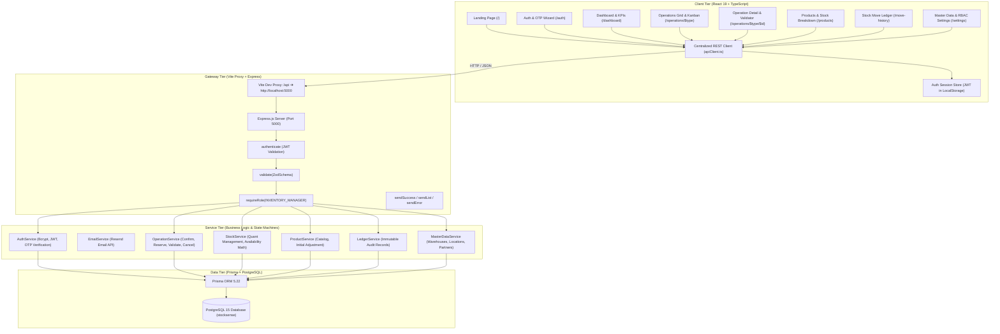
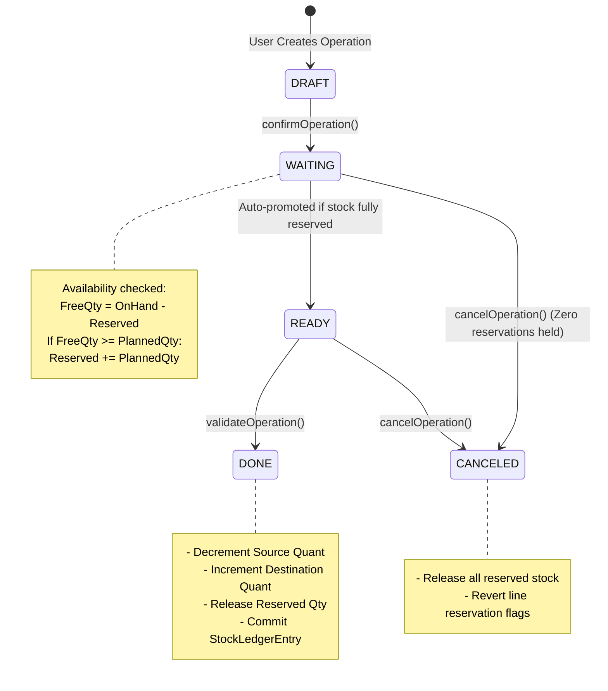

# StockSense: System Architecture & Technical Design

## 1. Architectural Philosophy
StockSense is an enterprise-grade Inventory & Warehouse Operating System built upon the mathematical foundation of **Double-Entry Bookkeeping applied to Physical Assets**.

In traditional accounting:
$$\text{Debits} = \text{Credits}$$

In StockSense:
$$\Delta \text{Stock}(\text{Source Location}) = -\Delta \text{Stock}(\text{Destination Location})$$

Inventory is never created or destroyed arbitrarily. Every stock modification represents an audited transfer between two distinct locations:
- **Physical Locations:** Internal warehouse zones, racks, aisles, shelves, and bins.
- **Virtual Locations:** System boundary locations representing external entities:
  - `Vendors` (Inbound origin for Receipts)
  - `Customers` (Outbound destination for Deliveries)
  - `Inventory Loss / Gain` (Adjustments and count reconciliations)
  - `Scrap / Damaged` (Quarantine and decommissioned goods)

---

## 2. High-Level Architecture Diagram



---

## 3. Stock State Machine & Reservation Lifecycle



### Mathematical Invariants
1. **Quantity on Hand ($Q_{oh}$):**
   $$Q_{oh} \ge 0 \quad \text{for all internal locations}$$
2. **Reserved Quantity ($Q_{res}$):**
   $$0 \le Q_{res} \le Q_{oh}$$
3. **Free to Use Quantity ($Q_{free}$):**
   $$Q_{free} = Q_{oh} - Q_{res} \ge 0$$

---

## 4. Role-Based Access Control (RBAC) Matrix

| Capability / Route | Inventory Manager | Warehouse Staff | Implementation Mechanism |
|---|:---:|:---:|---|
| **View Dashboard & KPIs** | Full Organization | Assigned Warehouse Station Only | Query filter by `user.warehouse_id` |
| **View Receipts & Deliveries** | All Warehouses | Assigned Warehouse Station Only | Query filter by `user.warehouse_id` |
| **Execute & Validate Moves** | Yes | Yes (at assigned station) | `OperationService.assertPermission` |
| **Manual Stock Adjustments** | Yes | No | Backend `requireRole(INVENTORY_MANAGER)` |
| **Warehouse & Location CRUD** | Yes | No (Hidden from Navigation) | `requireRole(INVENTORY_MANAGER)` |
| **Product Catalog Creation** | Yes | No (View Only) | `requireRole(INVENTORY_MANAGER)` |
| **Category & UoM Master Data**| Yes | No (Hidden from Navigation) | `requireRole(INVENTORY_MANAGER)` |
| **Staff Role Assignment** | Yes | No (Forbidden) | `requireRole(INVENTORY_MANAGER)` |

---

## 5. Double-Entry Stock Ledger Model

Whenever an operation transitions to the `DONE` status, the transaction atomically creates an immutable record in `stock_ledger_entries`:

```prisma
model StockLedgerEntry {
  id              BigInt         @id @default(autoincrement())
  product_id      BigInt
  location_id     BigInt
  quantity_change Decimal        @db.Decimal(12, 4)
  balance_after   Decimal        @db.Decimal(12, 4)
  operation_id    BigInt
  operation_type  OperationType
  reference_no    String         @db.VarChar(60)
  movement_date   DateTime       @default(now())
  created_by      BigInt
}
```

This guarantees that:
- Every physical change has a reference to the originating operation (`reference_no`).
- Every move records the timestamp and responsible operator ID.
- Reconciliation can reconstruct the exact state of inventory at any arbitrary point in history.

---

## 6. Transactional Email & Security Architecture (Resend API)

StockSense uses **[Resend](https://resend.com)** for transactional email communication:

```
[User Signup / Password Reset]
               │
               ▼
       [AuthService.ts]
               │
               ▼
       [EmailService.ts]
         ├── Has RESEND_API_KEY?
         │      ├── YES ➔ Dispatches real email via Resend API (resend.emails.send)
         │      └── NO / MOCK ➔ Logs OTP to console & simulator output
         │
         ▼
[User receives 6-digit code via inbox or dev console]
```

### Key Security Invariants
- **Expiry Enforcement:** OTP codes expire after 10 minutes (`expires_at: NOW + 10m`).
- **Single-Use Verification:** Codes are flagged `is_used: true` immediately upon verification or superseded by resend requests.
- **Fail-Safe Transport:** Network or deliverability issues with external mail transport do not block critical database operations; fallback codes are captured in dev mode.
