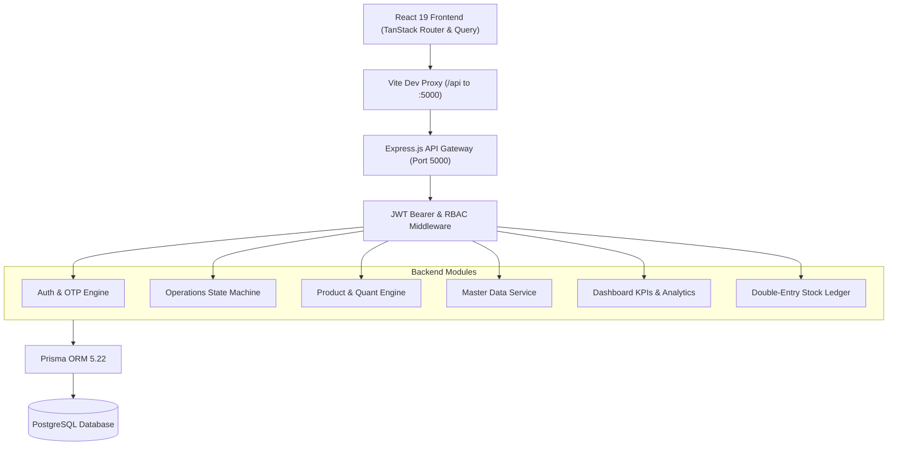
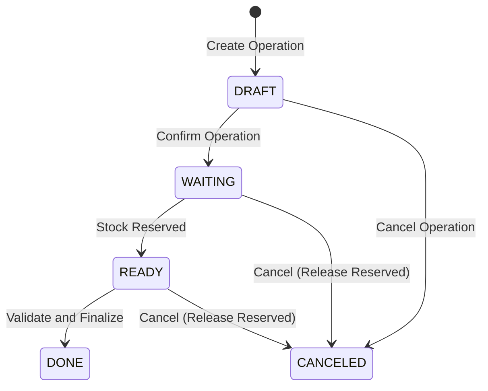

# StockSense 📦⚡
> **Enterprise-Grade Double-Entry Warehouse & Inventory Operating System**  
> *Engineered for zero-discrepancy stock management, atomic ledger traceability, and strict role-based operations.*

---

## 🌟 Overview

**StockSense** is an enterprise-grade warehouse management and inventory operating system. Built upon the mathematical rigor of **Double-Entry Asset Bookkeeping**, StockSense treats every unit of physical inventory like financial capital: every stock change requires a balanced transfer between an audited **Source Location** and a **Destination Location**.

By pairing double-entry accounting with an atomic state machine, StockSense guarantees:
- **Zero Phantom Inventory:** Active stock reservations prevent overselling and duplicate picking.
- **Short-Stock Safeguards:** Floor operators cannot dispatch or move stock that isn't physically available.
- **Complete Audit Traceability:** Every movement permanently registers an immutable double-entry ledger entry.
- **Persona-First Workspaces:** Tailored, high-speed execution interfaces for warehouse floor operators alongside comprehensive multi-facility control panels for inventory executives.

---

## 👥 Pre-Configured Demo Credentials

Explore StockSense immediately using our pre-seeded accounts:

| Persona | Role | Login ID | Password | Access Boundary & Scope |
|---|---|---|---|---|
| 🛡️ **Inventory Manager** | `INVENTORY_MANAGER` | `admin` | `Admin@1234` | Full access across all warehouses, product CRUD, settings, master data, user roles, manual stock adjustments, and global analytics. |
| 👷 **Warehouse Staff** | `WAREHOUSE_STAFF` | `staff` | `User@1234` | Station terminal: pinned to **Central Warehouse (WH1)**. Fast receipts, internal transfers, and deliveries. Administrative menus are automatically hidden. |

---

## 🏗️ System Architecture

StockSense is built as a modern, decoupled full-stack platform. The frontend communicates with the unified Express/PostgreSQL API gateway via a high-performance reverse proxy bridge:



---

## 🔄 Core Engineering Principles

### 1. Double-Entry Inventory Mechanics
Every movement is modeled as a transfer from a **Source Location** to a **Destination Location**:
- **Receipts:** Virtual `Vendor Location` ➔ Internal `Stock Location` (+ On-Hand inventory).
- **Deliveries:** Internal `Stock Location` ➔ Virtual `Customer Location` (- On-Hand inventory).
- **Internal Transfers:** Internal `Rack A` ➔ Internal `Rack B` (Zero aggregate facility change, location balance updated).
- **Adjustments:** Virtual `Inventory Loss/Gain Location` ➔ Internal `Stock Location` (with mandatory audit justification).

### 2. Mathematical Invariants
At all times across every product and location:
$$\text{Free to Use} = \text{Quantity on Hand} - \text{Quantity Reserved} \ge 0$$

### 3. Atomic State Machine Lifecycle
Every warehouse operation transitions through strict lifecycle states:



1. **`DRAFT`:** Planning stage. Line items, quantities, and target locations can be modified freely.
2. **`WAITING`:** Stock availability checked against source locations.
3. **`READY`:** Required inventory is locked and reserved; competing orders cannot claim these units.
4. **`DONE`:** Move is validated. Quantities are debited/credited, and permanent immutable ledger records are written.
5. **`CANCELED`:** Operation terminated. All reservations are released back to `Free to Use`.

---

## 📧 Resend Email Integration for Secure OTP Verification

StockSense uses **[Resend](https://resend.com)** for transactional email communication:
- **Signup Account Activation:** Dispatches an authentic 6-digit verification code with a 10-minute validity window.
- **Forgot Password Recovery:** Dispatches a 6-digit recovery OTP with rate limiting and a 60-second cooldown timer.
- **Dual-Mode Architecture:**
  - **Live Delivery:** When `RESEND_API_KEY` is provided in `server/.env`, emails are dispatched in real-time through Resend's global infrastructure.
  - **Dev Simulator:** If running locally without an active key or during offline testing, the system automatically simulates delivery by logging the exact OTP code to the console and returning it in development responses, guaranteeing zero friction during evaluation.

---

## 💻 Tech Stack Breakdown

### Frontend
- **Framework:** React 19 with strict TypeScript
- **Routing:** TanStack Router (type-safe file-based route tree with layout nesting)
- **State & Caching:** TanStack Query v5 with optimistic updates and automatic cache invalidation
- **Design System:** Tailwind CSS v4, Radix UI primitives, Lucide React Icons, Sonner toasts
- **Dev Server:** Vite with proxy bridge routing `/api` ➔ `http://localhost:5000`

### Backend
- **Runtime:** Node.js (ES Modules) + Express.js
- **ORM & DB Client:** Prisma 5.22
- **Database:** PostgreSQL 15+
- **Security:** JSON Web Tokens (JWT), bcrypt password hashing, Zod schema validation
- **Testing:** Vitest test suite with **95/95 passing unit and integration tests**

---

## 🔌 REST API Gateway Reference (`/api/v1`)

### Authentication & Users
| Method | Endpoint | Description | Access |
|---|---|---|---|
| `POST` | `/auth/signup` | Register new user account | Public |
| `POST` | `/auth/verify-signup-otp` | Verify 6-digit email activation code | Public |
| `POST` | `/auth/login` | Authenticate and obtain JWT token | Public |
| `POST` | `/auth/forgot-password` | Request password reset 6-digit OTP | Public |
| `POST` | `/auth/verify-reset-otp` | Verify reset OTP and obtain reset token | Public |
| `POST` | `/auth/reset-password` | Update password using reset token | Public |
| `POST` | `/auth/resend-otp` | Re-generate and resend fresh OTP | Public |
| `GET` | `/auth/me` | Fetch authenticated user profile | Authenticated |
| `PUT` | `/auth/me` | Update profile information | Authenticated |
| `PUT` | `/auth/password` | Change user password | Authenticated |
| `GET` | `/users` | List all staff with assigned roles & warehouses | Manager Only |
| `PUT` | `/users/:id` | Update staff role, warehouse, or active status | Manager Only |

### Operations Engine
| Method | Endpoint | Description | Access |
|---|---|---|---|
| `GET` | `/operations` | Filtered list (type, status, warehouse, search) | Authenticated |
| `POST` | `/operations` | Create new operation with line items | Authenticated |
| `GET` | `/operations/:id` | Get full operation details with lines & stock status | Authenticated |
| `PUT` | `/operations/:id` | Update mutable operation lines or header | Authenticated |
| `POST` | `/operations/:id/confirm` | Transition `DRAFT` ➔ `WAITING`/`READY` | Authenticated |
| `POST` | `/operations/:id/validate` | Transition `READY` ➔ `DONE` (Commit ledger) | Authenticated |
| `POST` | `/operations/:id/cancel` | Cancel operation & release reservations | Authenticated |
| `GET` | `/operations/:id/print` | Fetch print-ready dispatch slip / receipt data | Authenticated |

### Products & Inventory
| Method | Endpoint | Description | Access |
|---|---|---|---|
| `GET` | `/products` | List active products with category/UoM | Authenticated |
| `POST` | `/products` | Create product with optional opening balance | Manager Only |
| `GET` | `/products/:id` | Get product details with location quant breakdown | Authenticated |
| `PUT` | `/products/:id` | Update product attributes | Manager Only |
| `DELETE` | `/products/:id` | Soft-delete / archive product | Manager Only |
| `GET` | `/products/quants/all` | Fetch all stock quants across all locations | Authenticated |
| `PUT` | `/products/:id/stock/:locId` | Direct stock count adjustment | Manager Only |

### Master Data Configuration
| Method | Endpoint | Description | Access |
|---|---|---|---|
| `GET` / `POST` | `/warehouses` | List / Create warehouse | Manager Only (Write) |
| `PUT` / `DELETE`| `/warehouses/:id` | Update / Deactivate warehouse | Manager Only |
| `GET` / `POST` | `/locations` | List / Create storage location | Manager Only (Write) |
| `PUT` / `DELETE`| `/locations/:id` | Update / Deactivate location | Manager Only |
| `GET` / `POST` | `/categories` | List / Create product category | Manager Only (Write) |
| `PUT` / `DELETE`| `/categories/:id` | Update / Deactivate category | Manager Only |
| `GET` / `POST` | `/uom` | List / Create units of measure | Manager Only (Write) |
| `PUT` / `DELETE`| `/uom/:id` | Update / Deactivate UoM | Manager Only |
| `GET` / `POST` | `/partners` | List / Create suppliers or customers | Manager Only (Write) |
| `PUT` / `DELETE`| `/partners/:id` | Update / Deactivate partner | Manager Only |

### Dashboard & Analytics
| Method | Endpoint | Description | Access |
|---|---|---|---|
| `GET` | `/dashboard/kpis` | Real-time counts, low stock alerts, readiness | Authenticated |
| `GET` | `/stock-ledger` | Paginated immutable move ledger entries | Authenticated |

---

## ⚡ Quick Start & Setup Guide

### 1. Prerequisites
- **Node.js** >= 18.0.0
- **PostgreSQL** 15+ running on `localhost:5432` with database `stocksense` (default user `postgres`, password `postgres`).
- Optional: Free Resend API key from [resend.com](https://resend.com) for live email delivery.

### 2. Backend Setup
```bash
cd server

# Install dependencies
npm install

# Push Prisma schema to PostgreSQL database
npx prisma db push

# Seed master data (Admin, Staff, Warehouse WH1, Locations, Categories, UoM)
npm run db:seed

# Verify test suite (95 tests passing)
npm test

# Start Express API server (Port 5000)
npm run dev
```

### 3. Frontend Setup
```bash
cd ../client

# Install dependencies
npm install

# Start Vite client dev server (Port 8080)
npm run dev
```

### 4. Access the Application
- Open **`http://localhost:8080/`** in your browser.
- Use the **1-Click Copy** buttons on the landing page or enter demo credentials (`admin` / `Admin@1234` or `staff` / `User@1234`).

---

## 👥 Engineering Team & Credits
- **Manish Nemade** — Full-Stack Architecture, Database Modeling & Frontend Engineering
- **Abhay** — Backend Integration, Core Workflow Implementation & API Contracts
