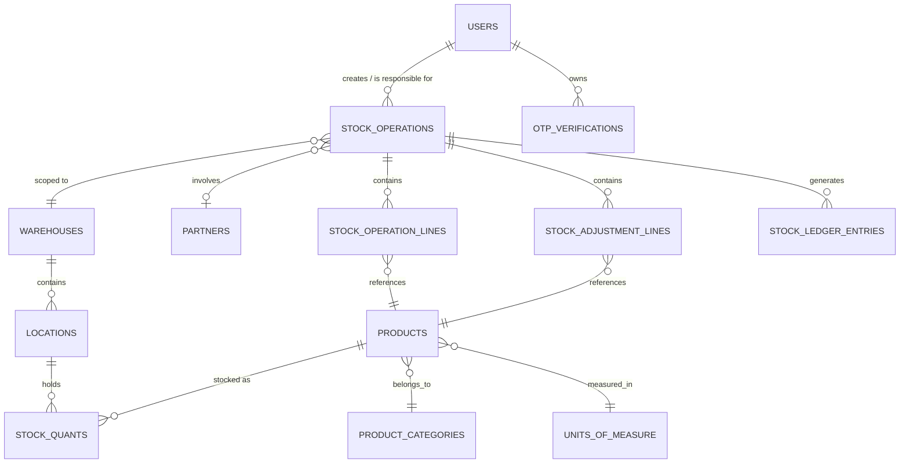
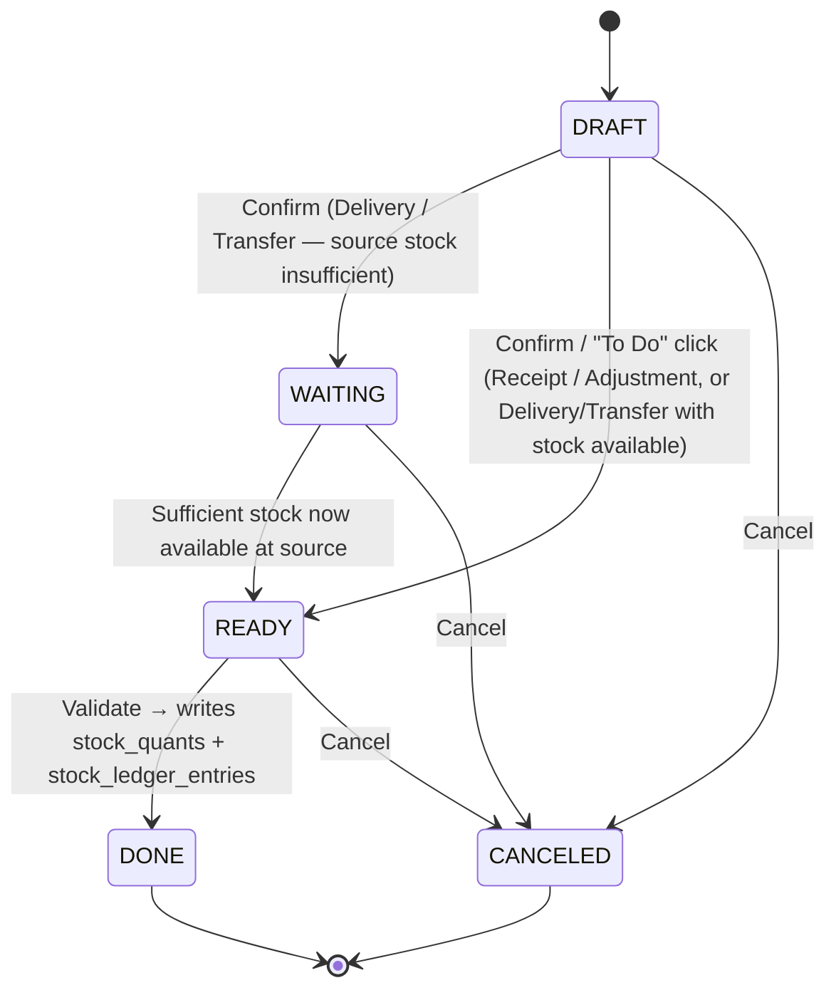

# StockSense — Technical Specification

### Inventory Management System | Field, Schema, API & Frontend-Flow Contract (v2 — aligned with Excalidraw mockup)

> Purpose: define **every field, entity, workflow, screen and API contract** so Frontend and Backend can build in parallel without mismatched fields. v2 incorporates the actual Excalidraw wireframe (Login/Signup, Dashboard, Products/Stock, Settings, Receipts, Deliveries, Move History). No tech-stack/framework opinions — only data + behavior + contracts. DB target: **PostgreSQL**.

> **What changed from v1, based on the mockup:** reference-number format corrected to the mockup's real scheme (`WH/IN/0001` style, not `RCPT-00001`); added `unit_cost`, `responsible_user_id`, `is_verified` fields; merged OTP tables into one reusable `otp_verifications`; added Kanban view mode, search-by-contact, per-status dashboard counters, red-flag-on-short-stock behavior, and a full screen-by-screen Frontend Flow section (§6). A dedicated **§10 "Mockup Clarifications"** lists everything that was unclear, missing, or looked duplicated in the screenshot — read that section before building the screens it refers to.

---

## 1. Scope Recap

Two roles: **Inventory Manager** (full control) and **Warehouse Staff** (execution: transfers, picking, shelving, counting). Global nav (confirmed from every mockup screen's header): **Dashboard | Operations | Products | Move History | Settings**, plus a **profile icon, top-right of every screen** (opens My Profile / Logout — not a left sidebar as the source PDF suggested; the mockup is the newer, authoritative source for placement).

Every stock movement (Receipt / Delivery / Internal Transfer / Adjustment) is one unified "operation" record that goes through a status flow and writes to one shared Stock Ledger — this is the backbone of the whole schema below.

---

## 2. Global Conventions (agree on these FIRST)

| Convention | Rule |
| --- | --- |
| Field naming | `snake_case` everywhere — DB columns AND JSON API fields |
| IDs | `BIGSERIAL` PKs, sent as integers in JSON |
| Dates/time | `TIMESTAMPTZ` in DB, ISO-8601 UTC string in API |
| Quantities / cost | `NUMERIC(14,3)` for quantities, `NUMERIC(14,2)` for money — never float |
| Enums | Native Postgres `ENUM` types (§4.0), sent as uppercase strings in API |
| Auth | Bearer token on every request except `/auth/*` |
| Success | \`{ "success": true, "data": \<object |
| List | `{ "success": true, "data": [...], "meta": { "page", "limit", "total" } }` |
| Error | `{ "success": false, "error": { "code", "message" } }` |
| Soft delete | Master data uses `is_active boolean`, never hard-deleted if referenced |
| **Reference number** (per mockup, this is the authoritative format — supersedes any earlier draft) | `<warehouse_short_code>/<op_code>/<sequence>` e.g. **`WH1/IN/0001`**. `op_code` = `IN` (Receipt), `OUT` (Delivery), `INT` (Internal Transfer), `ADJ` (Adjustment). Sequence auto-increments per `(warehouse_id, op_code)` pair, zero-padded to 4 digits. Generated server-side on record creation, never client-supplied. |
| View modes | Every Operations/Move-History list screen supports `?view=list` (default) or `?view=kanban` (grouped by `status` column) — same endpoint/data, just a grouping toggle, no separate backend logic needed |
| List search | `?search=` matches `reference_no` (partial) **OR** partner/contact name — one shared search contract reused on every list screen |

---

## 3. User Roles & Permission Matrix

| Capability | Inventory Manager | Warehouse Staff |
| --- | --- | --- |
| Manage Products / Categories / UoM | ✅ Full | 👁 View only |
| Manage Warehouses / Locations | ✅ Full | 👁 View only |
| Manage Reordering Rules | ✅ Full | ❌ |
| Create / Confirm Receipts | ✅ | ❌ (assumption — confirm with team) |
| Validate Receipts (goods physically arriving) | ✅ | ✅ |
| Create / Pick-Pack / Validate Deliveries | ✅ | ✅ |
| Create / Validate Internal Transfers | ✅ | ✅ |
| Perform Stock Adjustments (counting) | ✅ | ✅ |
| Reassign "Responsible" on an operation | ✅ | ❌ |
| Cancel any operation (non-Done) | ✅ | Own drafts only |
| View Dashboard & Move History | ✅ Full | ✅ Own-warehouse scope (filtered by `users.warehouse_id`, §4.2) |
| Manage other users | ✅ | ❌ |

---

## 4. Data Model

### 4.0 Enum Types

```sql
CREATE TYPE user_role        AS ENUM ('INVENTORY_MANAGER','WAREHOUSE_STAFF');
CREATE TYPE operation_type   AS ENUM ('RECEIPT','DELIVERY','INTERNAL_TRANSFER','ADJUSTMENT');
CREATE TYPE operation_status AS ENUM ('DRAFT','WAITING','READY','DONE','CANCELED');
CREATE TYPE partner_type     AS ENUM ('SUPPLIER','CUSTOMER');
CREATE TYPE location_type    AS ENUM ('INTERNAL','VENDOR','CUSTOMER','ADJUSTMENT_VIRTUAL');
CREATE TYPE otp_purpose      AS ENUM ('SIGNUP_VERIFICATION','PASSWORD_RESET');
```

### 4.1 Entity Relationship Overview



### 4.2 Entity Field Reference

**`users`**

| Field | Type | Notes |
| --- | --- | --- |
| id | BIGSERIAL PK |  |
| login_id | VARCHAR(60) UNIQUE | required — **separate field from email**; the Sign Up screen has both "Enter Login Id" and "Enter Email Id" as two distinct boxes, and the Login screen asks only for "Login Id", so these cannot be merged into one `email` column as v1 assumed |
| email | VARCHAR(160) UNIQUE | required — used for OTP delivery / notifications, not for login |
| full_name | VARCHAR(120), nullable | **not collected at signup** (no such field on the Sign Up screen) — nullable at creation, filled in later via My Profile (§6.9) |
| password_hash | TEXT | never returned in API |
| role | user_role, default 'WAREHOUSE_STAFF' | **not chosen by the user at signup** (no role field on the Sign Up screen) — every new signup defaults to Warehouse Staff; promoting someone to Inventory Manager is an admin action outside this MVP's screens (see §9) |
| warehouse_id | FK → warehouses, nullable | **new** — needed to actually enforce the "Warehouse Staff: own-warehouse scope" row in §3, which had no field to scope by. Set by a Manager after signup (no field for it on the Sign Up screen either) |
| phone | VARCHAR(20) | optional |
| is_verified | BOOLEAN default false | set true after signup-OTP confirmed; login blocked until true (assumption, confirm with team) |
| is_active | BOOLEAN default true |  |
| created_at / updated_at | TIMESTAMPTZ |  |

**`otp_verifications`** (merged table — reused for both signup verification and password reset, per mockup note "forwarded to auth OTP procedure" after signup)

| Field | Type | Notes |
| --- | --- | --- |
| id | BIGSERIAL PK |  |
| user_id | FK → users |  |
| purpose | otp_purpose | required |
| otp_code | VARCHAR(6) | 6-digit |
| expires_at | TIMESTAMPTZ | e.g. now()+10min |
| is_used | BOOLEAN default false |  |
| created_at | TIMESTAMPTZ |  |

**`warehouses`**

| Field | Type | UI label (mockup) |
| --- | --- | --- |
| id | BIGSERIAL PK | — |
| name | VARCHAR(120) | "Name" |
| code | VARCHAR(20) UNIQUE | "Short Code" |
| address | TEXT | "Address" |
| is_active | BOOLEAN default true | — |

**`locations`**

| Field | Type | UI label (mockup) | Notes |
| --- | --- | --- | --- |
| id | BIGSERIAL PK | — |  |
| warehouse_id | FK → warehouses, nullable | "Warehouse" (dropdown) | null only for VENDOR/CUSTOMER virtual rows |
| parent_location_id | FK → locations, nullable | *not shown in wireframe* | **keep this field anyway** — PDF's "Rack A → Rack B" nested example needs it even though the Location form screenshot doesn't show a parent picker; add it as an optional field on the form |
| name | VARCHAR(120) | "Name" | e.g. "Stock1", "Production Floor" |
| code | VARCHAR(30) | "Short Code" |  |
| location_type | location_type | — | VENDOR/CUSTOMER/ADJUSTMENT_VIRTUAL rows are system-seeded, not user-creatable from this form |
| is_active | BOOLEAN default true | — |  |

**`product_categories`**: id, name VARCHAR(100), parent_category_id FK nullable.

**`units_of_measure`**: id, name VARCHAR(40), code VARCHAR(10) (e.g. "pcs", "kg").

**`products`**

| Field | Type | Notes |
| --- | --- | --- |
| id | BIGSERIAL PK |  |
| name | VARCHAR(150) | required |
| sku | VARCHAR(60) UNIQUE | required, shown as `[DESK001]` style tag in operation lines |
| barcode | VARCHAR(60) | optional |
| category_id | FK → product_categories | required |
| uom_id | FK → units_of_measure | required |
| unit_cost | NUMERIC(14,2) default 0 | **new — "per unit cost" column seen on the Stock screen** |
| description | TEXT | optional |
| reorder_min_qty | NUMERIC(14,3) default 0 |  |
| reorder_max_qty | NUMERIC(14,3) nullable |  |
| is_active | BOOLEAN default true |  |
| created_at / updated_at | TIMESTAMPTZ |  |

> **Initial stock (optional, from the PDF)** is **not** a `products` column. `POST /products` accepts optional `initial_stock_quantity` + `initial_stock_location_id`; if both are given, the backend creates **and immediately validates** a `stock_operations` row (`operation_type=ADJUSTMENT`, `recorded_quantity=0`, `counted_quantity=initial_stock_quantity`) right after the product is created, so the opening balance still passes through the Ledger instead of being written directly to `stock_quants`. This note was dropped by mistake in the previous revision — restored here and reflected in §7's `POST /products`.

**`partners`** (Suppliers for Receipts, Customers for Deliveries — mockup's "Contact" column) id, name VARCHAR(150), type (partner_type), email, phone, address, is_active.

**`stock_operations`** (unified header for all 4 operation types)

| Field | Type | Notes |
| --- | --- | --- |
| id | BIGSERIAL PK |  |
| reference_no | VARCHAR(30) UNIQUE | `WH1/IN/0001` format, see §2 |
| operation_type | operation_type |  |
| status | operation_status default 'DRAFT' |  |
| warehouse_id | FK → warehouses |  |
| source_location_id | FK → locations, nullable | required for RECEIPT/DELIVERY/TRANSFER, null for ADJUSTMENT |
| destination_location_id | FK → locations, nullable | same as above |
| partner_id | FK → partners, nullable | required for RECEIPT & DELIVERY, null for TRANSFER/ADJUSTMENT |
| scheduled_date | TIMESTAMPTZ | required — drives "Late" tag when `< now()` |
| validated_date | TIMESTAMPTZ, nullable | set on Validate |
| created_by | FK → users | audit only, immutable |
| responsible_user_id | FK → users, nullable | **new — mockup's "Responsible" field, auto-filled with the logged-in user on create, reassignable by a Manager** |
| notes | TEXT | optional |
| created_at / updated_at | TIMESTAMPTZ |  |

**`stock_operation_lines`** (RECEIPT / DELIVERY / INTERNAL_TRANSFER)

| Field | Type | Notes |
| --- | --- | --- |
| id | BIGSERIAL PK |  |
| operation_id | FK → stock_operations |  |
| product_id | FK → products |  |
| uom_id | FK → units_of_measure | defaults from product |
| quantity_planned | NUMERIC(14,3) | ordered/expected qty — the mockup's form only shows **one** "Quantity" box, so UI may set `quantity_planned = quantity_done` on entry for the simple flow; keep both columns in DB for flexibility |
| quantity_done | NUMERIC(14,3) default 0 | actual received/picked/moved — this is what the ledger uses |
| notes | TEXT | optional |

**`stock_adjustment_lines`** (ADJUSTMENT only) id, operation_id FK, product_id FK, location_id FK, uom_id FK, recorded_quantity (system value, auto-filled, read-only to client), counted_quantity (user input), difference (backend-computed = counted − recorded).

**`stock_quants`** (live stock — single source of truth)

| Field | Type | Notes |
| --- | --- | --- |
| id | BIGSERIAL PK |  |
| product_id | FK → products |  |
| location_id | FK → locations |  |
| quantity | NUMERIC(14,3) default 0 | = mockup's **"On hand"** |
| reserved_quantity | NUMERIC(14,3) default 0 | see lifecycle rule below |
| updated_at | TIMESTAMPTZ |  |
| — | UNIQUE(product_id, location_id) | `free_to_use` (mockup column) = `quantity − reserved_quantity`, computed on read, not stored |

**`reserved_quantity` lifecycle (was undefined in v2, now explicit):**

- **+= quantity_planned** at the operation's `source_location`, for DELIVERY/INTERNAL_TRANSFER lines only, the moment the operation leaves `DRAFT` (i.e. on `/confirm`, whether it lands in `WAITING` or `READY`).
- **−= quantity_planned** (released) at the same location if the operation is later `Canceled` from `WAITING`/`READY`.
- **−= quantity_planned**, at the same time `quantity.−= quantity_done` happens, when the operation is `Validated` (the reservation is consumed, not just released, since the stock has actually left).
- RECEIPT and ADJUSTMENT never touch `reserved_quantity` (nothing is being held back from other operations by them).

**`stock_ledger_entries`** (= Move History screen, immutable) id, product_id FK, location_id FK, quantity_change (signed), balance_after, operation_id FK, operation_type (denormalized), reference_no (denormalized), movement_date, created_by.

> Rule unchanged from v1: `stock_quants` and `stock_ledger_entries` are written **only** by a Validate action, server-side — never by a direct client write, including the Stock screen's inline "update stock" (see §6.3).

---

## 5. Universal Operation Status Workflow



**Meaning of each status** (verbatim intent from the mockup's callouts):

| Status | Receipt | Delivery / Internal Transfer | Adjustment |
| --- | --- | --- | --- |
| DRAFT | Initial stage | Initial stage | Initial stage |
| WAITING | *(not used)* | Waiting for the out-of-stock product to be back in stock | *(not used)* |
| READY | Ready to receive | Ready to deliver | Ready to count/apply |
| DONE | Received | Delivered / Transferred | Applied |
| CANCELED | Aborted | Aborted | Aborted |

**Form buttons per status (Receipt/Delivery detail screens):**

- While `DRAFT` → button shows **"To Do"**; click → status becomes `READY` (or `WAITING` for Delivery/Transfer if source stock is short).
- While `READY` → button shows **"Validate"**; click → status becomes `DONE`, ledger is written.
- **"Print"** button is only meaningful once `status = DONE` (prints the receipt/delivery slip).
- **"Cancel"** available at any state before `DONE`.

**"Late" vs "on schedule" tagging (used on Dashboard + list screens):**

- `Late` = `scheduled_date < now()` AND status not in (DONE, CANCELED).
- Not late = `scheduled_date >= now()` AND status not in (DONE, CANCELED).

---

## 6. Frontend Screen-by-Screen Flow (mapped 1:1 to the mockup)

### 6.1 Login / Sign Up

| Screen | Fields | Behavior |
| --- | --- | --- |
| **Login** | Login Id, Password, "SIGN IN" button, "Forgot Password? \| Sign Up" links | Login Id here = `users.login_id`, **not** `email` — they're separate fields (see §4.2 fix). On success → redirect to Dashboard. On "Forgot Password?" → OTP-based reset flow (request OTP → verify OTP → set new password, using `otp_verifications` with `purpose='PASSWORD_RESET'`, sent to the account's `email`). |
| **Sign Up** | Login Id, Email Id, Password, Re-Enter Password, "SIGN UP" button | Login Id and Email Id both required and both unique (reject duplicates with a clear error, tell the user which one clashed). If password ≠ confirm password → inline error, don't submit. **No Name field and no Role field on this screen** — `full_name` is left null (collected later in My Profile, §6.9) and `role` defaults to `WAREHOUSE_STAFF` server-side (see §9 for how a Manager account gets created). On success → account created with `is_verified=false`, OTP sent to `email` (`purpose='SIGNUP_VERIFICATION'`) → user redirected to **Login** page (per mockup note: "on Sign Up should redirect to login page") to complete OTP verification before first login. |

> Some annotation text in the screenshot was too small to transcribe with full confidence (see §10). The field list and the two flows above are what's clearly legible and safe to build against.

### 6.2 Dashboard (landing page after login)

Two summary cards visible in the mockup. The other 3 KPIs from the PDF weren't in this screenshot but are still required — their exact formulas (missing in the previous revision) are given below alongside the two mockup cards:

| KPI / Card | Sub-metrics shown | Formula |
| --- | --- | --- |
| **Receipt** card | "`X` Late" · "`Y` operations" · button "`N` to receive" | Late = §5 rule, scoped to `operation_type=RECEIPT`. Operations = count of RECEIPT rows not in (DONE, CANCELED). Button `N` = count of RECEIPT rows with `status=READY` (actionable now). |
| **Delivery** card | "`X` Late" · "`Y` waiting" · "`Z` operations" · button "`N` to Deliver" | Late/Operations as above for `operation_type=DELIVERY`. Waiting = count with `status=WAITING`. Button `N` = count with `status=READY`. |
| `total_products` | — | `COUNT(products WHERE is_active = true)` |
| `low_stock_count` | — | `COUNT(products p WHERE p.is_active AND 0 < (SELECT SUM(quantity) FROM stock_quants WHERE product_id=p.id) <= p.reorder_min_qty)` |
| `out_of_stock_count` | — | `COUNT(products p WHERE p.is_active AND COALESCE((SELECT SUM(quantity) FROM stock_quants WHERE product_id=p.id), 0) = 0)` |
| `transfers_scheduled` | — | `COUNT(stock_operations WHERE operation_type='INTERNAL_TRANSFER' AND status NOT IN ('DONE','CANCELED'))` |

Clicking a card's button routes to that operation type's **List View**, pre-filtered to the relevant status. All four formula-only KPIs above can optionally be scoped with `?warehouse_id=` the same way the two cards are.

### 6.3 Products → Stock (sub-view under "Products" nav item, not its own top-level nav item)

| Column | Source |
| --- | --- |
| Product | `products.name` |
| per unit cost | `products.unit_cost` |
| On hand | `stock_quants.quantity` (summed if multi-location, or per-location row) |
| Free to Use | computed: `quantity − reserved_quantity` |

"User must be able to update the stock from here" → the on-hand cell is inline-editable, but **must not** write `stock_quants` directly. On save, backend silently creates **and validates** a `stock_operations` row of `operation_type=ADJUSTMENT` (recorded_quantity = old value, counted_quantity = new value entered here) so it still lands in the Ledger — same rule as the dedicated Adjustment screen (§6.7).

### 6.4 Settings → Warehouse / Location

- **Warehouse form**: Name, Short Code, Address → maps directly to `warehouses` (§4.2).
- **Location form**: Name, Short Code, Warehouse (dropdown) → maps to `locations`; add a "Parent Location" dropdown even though not in the screenshot (see §4.2 note). VENDOR/CUSTOMER/ADJUSTMENT virtual locations are seeded by the backend and never appear in this form.

### 6.5 Operations → Receipts

- **List View** (default landing) / **Kanban View** toggle, columns: Reference, From, To, Contact, Schedule Date, Status. "From"/"To" show location short-codes (e.g. `vendor` → `WH1/Stock1`). Search bar filters by reference or contact (§2).
- **Detail/Form View**: Reference (auto), "Receive From" (= `partner_id`, supplier), Schedule Date, Responsible (auto-filled with logged-in user, see `responsible_user_id`), Products table (SKU + Quantity, "New Product" row to add lines). Buttons: To Do / Validate (status-dependent, §5), Print (enabled once Done), Cancel.

### 6.6 Operations → Deliveries

Same List/Kanban/search pattern as Receipts. **Detail/Form View**: "Delivery Address" (display, sourced from the selected `partner_id`'s address — confirm with team if this should instead be a free-text override field), Schedule Date, Responsible, "Operation Type" (read-only badge = `DELIVERY`), Products table. **Important UX rule from the mockup**: if a line's `quantity_planned` exceeds what's currently available at the source location, **that line renders red and an alert/notification is shown** — backend should return a computed `is_short` boolean (and `available_at_source` value) per line in the `GET` response so the frontend doesn't need a separate stock lookup (added to §7 API contract).

### 6.7 Operations → Internal Transfers & Adjustments

**Not present in the provided screenshot** (flagged in §10 as likely a missing page, not an intentionally dropped feature — the PDF explicitly requires both). Build these mirroring the exact List/Detail pattern above:

- **Internal Transfer**: List columns Reference (`WH1/INT/0001`), From, To, Schedule Date, Status (no "Contact" column — no external partner involved). Detail form: Source Location, Destination Location, Schedule Date, Responsible, Products table.
- **Adjustment**: List columns Reference (`WH1/ADJ/0001`), Location, Schedule Date, Status. Detail form: Location, Schedule/Count Date, Responsible, Products table with **Recorded Qty** (read-only) and **Counted Qty** (input) side by side per line.

### 6.8 Move History

The mockup's rows show a **Status** column with values like "Ready" — but `stock_ledger_entries` (§4.2) has no `status` column and only ever gets a row when an operation reaches `DONE` (a pure done-only value is always "Done", which contradicts a "Ready" row appearing). This means the screen isn't a plain dump of `stock_ledger_entries`; it must be sourced by joining back to the parent operation. **Explicit response mapping** for `GET /stock-ledger`:

| List column | Source |
| --- | --- |
| Reference | `stock_operations.reference_no` (via `stock_ledger_entries.operation_id` → `stock_operations`) |
| Date | `stock_operations.scheduled_date` (or `validated_date` once Done) |
| Contact | `partners.name` via `stock_operations.partner_id` (blank for Transfer/Adjustment) |
| From / To | `locations.name` for `source_location_id` / `destination_location_id` |
| Quantity | `stock_ledger_entries.quantity_change` (absolute value) if the row is Done; otherwise the line's `quantity_planned` for not-yet-Done rows |
| **Status** | `stock_operations.status` — **not** stored on the ledger table itself, always read live from the parent operation |

In short: this endpoint queries `stock_operations` (+ lines) for the list itself, and only pulls `stock_ledger_entries` for rows that need the immutable, already-moved quantity (i.e. `status=DONE`). List/Kanban toggle + search, same contract as §2. Display rule from mockup: **stock-in rows in green, stock-out rows in red** (based on movement direction). If one reference has multiple product lines, show one row per line (not merged). A "New" button appears in the wireframe on this screen — **recommend removing it**; nobody should be able to hand-create a ledger/history row (see §10).

### 6.9 Profile menu (top-right icon on every screen)

My Profile (view/edit `full_name`, `phone`, change password) · Logout.

---

## 7. API Contract

### Auth

| Method & Path | Body | Response `data` |
| --- | --- | --- |
| POST /auth/signup | login_id, email, password | user, message ("OTP sent to email"). `role` defaults to `WAREHOUSE_STAFF` server-side, not accepted from the client; `full_name` is left null |
| POST /auth/verify-signup-otp | login_id, otp_code | message → redirect to login |
| POST /auth/login | login_id, password | user, token (blocked with a clear error if `is_verified=false`) |
| POST /auth/forgot-password | login_id or email | message |
| POST /auth/verify-reset-otp | login_id, otp_code | reset_token |
| POST /auth/reset-password | reset_token, new_password | message |
| GET /auth/me | — | user |
| POST /auth/logout | — | message |

### Dashboard

| Method & Path | Query | Response `data` |
| --- | --- | --- |
| GET /dashboard/kpis | warehouse_id? | total_products, low_stock_count, out_of_stock_count, receipts: {late, total, ready_count}, deliveries: {late, waiting, total, ready_count}, transfers_scheduled |

### Products & Stock

| Method & Path | Notes |
| --- | --- |
| GET /products | search?, category_id?, page, limit |
| POST /products | name, sku, barcode?, category_id, uom_id, unit_cost, reorder_min_qty, reorder_max_qty, **initial_stock_quantity?, initial_stock_location_id?** (both optional, but if one is given the other becomes required — see §4.2 note) |
| GET / PUT / DELETE /products/{id} | DELETE = soft delete |
| GET /products/{id}/stock | → `[{location_id, location_name, unit_cost, on_hand, free_to_use}]` |
| PUT /products/{id}/stock/{location_id} | body: `{counted_quantity}` → internally creates+validates an ADJUSTMENT (§6.3), returns updated on_hand/free_to_use |

### Categories / UoM / Warehouses / Locations (full CRUD — v2 only listed GET/POST by mistake)

| Resource | Endpoints | Body fields |
| --- | --- | --- |
| Categories | `GET/POST /categories`, `GET/PUT/DELETE /categories/{id}` | name, parent_category_id? |
| UoM | `GET/POST /uom`, `GET/PUT/DELETE /uom/{id}` | name, code |
| Warehouses | `GET/POST /warehouses`, `GET/PUT/DELETE /warehouses/{id}` | name, code, address? |
| Locations | `GET/POST /locations`, `GET/PUT/DELETE /locations/{id}` | warehouse_id?, parent_location_id?, name, code, location_type |

All `DELETE`s are soft deletes (`is_active=false`) per §2, subject to the reference-check in §8 rule 7.

### Receipts / Deliveries / Transfers (same shape, differ by `operation_type`)

| Method & Path | Body | Notes |
| --- | --- | --- |
| GET /receipts \| /deliveries \| /transfers | `?status=&warehouse_id=&search=&view=list\|kanban&page=&limit=` |  |
| POST /receipts | partner_id, warehouse_id, destination_location_id, scheduled_date, lines:\[{product_id, uom_id, quantity_planned}\] | source auto = Vendor virtual loc |
| POST /deliveries | partner_id, warehouse_id, source_location_id, scheduled_date, lines:\[...\] | destination auto = Customer virtual loc |
| POST /transfers | warehouse_id, source_location_id, destination_location_id, scheduled_date, lines:\[...\] |  |
| GET /{ops}/{id} | — | full detail + lines; each line includes `available_at_source` and `is_short` (for Delivery/Transfer only, drives the red-flag UI, §6.6) |
| PUT /{ops}/{id} | responsible_user_id?, lines (quantity_done updates) | only while status ≠ DONE/CANCELED |
| POST /{ops}/{id}/confirm | — | DRAFT → WAITING/READY ("To Do" button) |
| POST /{ops}/{id}/validate | — | READY → DONE, triggers ledger write |
| POST /{ops}/{id}/cancel | — | → CANCELED |
| GET /{ops}/{id}/print | — | only when status=DONE; printable receipt/delivery slip |

### Adjustments

GET /adjustments (`?status=&warehouse_id=&search=&view=&page=&limit=`) · POST /adjustments (warehouse_id, lines:\[{product_id, location_id, counted_quantity}\] — backend fills `recorded_quantity`) · **POST /adjustments/{id}/confirm** (`DRAFT → READY`, matches the `DRAFT→READY→DONE` flow in §5's table — missing from v2) · POST /adjustments/{id}/validate (`READY → DONE`).

### Move History & Profile

GET /stock-ledger (`?product_id=&location_id=&warehouse_id=&operation_type=&date_from=&date_to=&search=&view=&page=&limit=`) · GET/PUT /profile (full_name, phone, password).

---

## 8. Cross-Module Business Rules (enforce server-side)

1. `sku` and warehouse `code` must be unique.
2. An operation can't be validated if **every** line has `quantity_done = 0`. Otherwise, Validate proceeds using whatever `quantity_done` each line currently has — **partial amounts (less than `quantity_planned`) are allowed and don't need a separate status or flag**: the operation still moves straight to `DONE`, and the Ledger reflects exactly the `quantity_done` values, not the planned ones. There is no `PARTIALLY_DONE` state. The unfulfilled remainder (`quantity_planned − quantity_done`) is **not** auto-converted into a backorder/new operation in this MVP — if the team wants that, it's a separate feature to design later, not implied by this rule.
3. Delivery/Transfer validation fails if `quantity_done` > available stock at `source_location` — return a specific error code, not a generic 400.
4. `status=DONE` → operation and its lines are immutable, no further PUT.
5. `stock_quants` / `stock_ledger_entries` are written **only** inside Validate endpoints — including the Stock screen's quick-edit (§6.3) and never by any other route.
6. Adjustment's `recorded_quantity` is always pulled fresh server-side from `stock_quants`, never accepted from the client.
7. Soft-deleting a product/warehouse/location referenced by a non-canceled operation should be blocked or require force-confirmation.
8. Login blocked while `users.is_verified = false` (pending signup OTP) — return a specific "verify your account" error, not a generic auth failure.

---

## 9. Assumptions (confirm with team/mentor)

- Lot/Serial tracking and costing/valuation reports: out of scope for MVP.
- No external Sales Order entity — Deliveries are standalone records.
- Manager-vs-Staff split in §3 is a reasonable default, not an explicit rule in either source doc.
- "Delivery Address" being sourced from `partner.address` vs. a free-text override field (§6.6) needs a team decision.
- "Operation Type" field on the Delivery form (§6.6) is treated as a read-only badge, not a configurable setting — confirm this reading is correct.
- Since every signup now defaults to `WAREHOUSE_STAFF` (no role field on the Sign Up screen), there must be **some** way to get the first `INVENTORY_MANAGER` — e.g. a seeded admin row, or a manual DB update. No screen in the mockup handles promoting a user or assigning `warehouse_id`, so this is a real gap the team needs to close (a simple "Manage Users" screen for Managers, or a one-time seed script, would both work).

---

## 10. Mockup Clarifications & Inconsistencies (read before building the affected screens)

| # | What the screenshot showed | Issue | Recommendation |
| --- | --- | --- | --- |
| 1 | Nav bar reads "Products" on most screens, but "Stock" on the Dashboard screen | Inconsistent label for the same nav item | Standardize on **"Products"** as the nav item; "Stock" is a sub-tab inside it (§6.3), not a separate top-level page |
| 2 | Reference format note under Receipts list: `WH/IN/001`, `<Warehouse>/<Operation>/<ID>` | This is the only place the format is explicitly documented | Treated as authoritative — used throughout this doc (§2, §4.2, §7) |
| 3 | Delivery list's "To" column shows literally **"vendor"** for both sample rows | Almost certainly a copy-paste leftover from the Receipts screen template, since Delivery's destination should be a Customer/virtual location, not a vendor | Do not hardcode "vendor" for Delivery destinations — use the actual Customer virtual location / partner name |
| 4 | A caption under the Receipts list table reads "Populate all work orders added to manufacturing order" | There's no Manufacturing/Work Order concept anywhere else in the problem statement — looks like a stray note copied from an unrelated (Odoo Manufacturing) template | Ignore; Receipts list should simply populate all Receipt records |
| 5 | No screens exist for **Internal Transfer** or **Adjustment**, though the source PDF requires both with worked examples | Likely missing pages in the export, not a scope cut | Built by extrapolation from the Receipt/Delivery pattern in §6.7 — please sanity-check against the original Excalidraw file if possible |
| 6 | A "NEW" button appears on the Move History screen | Conflicts with the rule that ledger entries are system-generated only (§8 rule 5) | Recommend removing the button from this screen |
| 7 | Login/Signup callout text was small/low-resolution in the screenshot | A few annotation lines couldn't be transcribed with full confidence | The field lists and flow in §6.1 reflect only what was clearly legible; re-verify exact copy/wording against the source Excalidraw file directly |
| 8 | Location form doesn't show a parent-location field | Contradicts the PDF's own "Rack A → Rack B" nested-location example | Field kept in schema and recommended for the form anyway (§4.2, §6.4) |
| 9 | Two "This page contains the warehouse details & location" captions appear on the image (once at the very top, once above the Stock screen) | Looks like a duplicated/misplaced annotation | Treated as referring to the Warehouse + Location screens only (§6.4); ignored as a duplicate elsewhere |