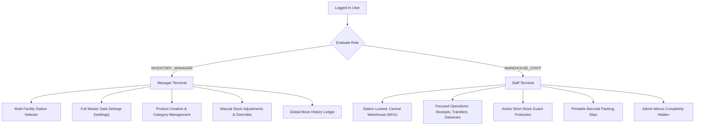

# StockSense Client 📦⚡
> **Modern React 19 Frontend for Enterprise Double-Entry Warehouse & Inventory Operations**  
> *Engineered with TanStack Router, TanStack Query v5, Tailwind CSS, and direct Express/PostgreSQL REST integration.*

---

## 🌟 Project Overview & Team Credits

**StockSense** was architected and developed by **Manish Nemade** and **Abhay** as a state-of-the-art warehouse operating system designed to eradicate phantom inventory, mis-picks, and un-audited stock adjustments.

The client application is an ultra-fast, single-page enterprise web terminal built specifically for:
1. **High-Speed Floor Operations:** Barcode-ready line item picking, station pinning, short-stock safeguards, and printable packing slips for warehouse staff.
2. **Executive Multi-Facility Governance:** Cross-warehouse visibility, automated reorder tracking, master data configuration, and immutable double-entry movement auditing for inventory managers.

---

## 🏗️ Architecture & Communication Flow

The frontend connects directly to the **StockSense Express.js / PostgreSQL Backend Gateway** (Port 5000) using a zero-latency Vite development reverse proxy:

```mermaid
graph LR
    subgraph Browser ["StockSense Frontend (:8080)"]
        UI["React 19 UI Components"]
        Router["TanStack Router (Route Guards)"]
        Query["TanStack Query v5 (Cache Engine)"]
        Client["API Client (src/services/apiClient.ts)"]
    end

    subgraph DevProxy ["Vite Dev Server (:8080)"]
        Proxy["Reverse Proxy (/api to :5000)"]
    end

    subgraph Backend ["StockSense Backend (:5000)"]
        Gateway["Express Gateway (/api/v1)"]
        Auth["JWT / RBAC Middleware"]
        Controllers["Ops / Products / Master Controllers"]
        Prisma["Prisma ORM 5.22"]
        DB[("PostgreSQL")]
    end

    UI --> Router
    Router --> Query
    Query --> Client
    Client -->|HTTP /api/v1/*| Proxy
    Proxy -->|Forward| Gateway
    Gateway --> Auth
    Auth --> Controllers
    Controllers --> Prisma
    Prisma --> DB
```



> [!NOTE]
> **Zero SaaS Auth Lock-in:** The frontend has been completely purged of external BaaS dependencies (e.g. Supabase). All authentication, OTP verification, session refreshes, and data operations execute against your dedicated Express + PostgreSQL backend.

---

## 🛠️ Technology Stack

| Layer | Technology | Purpose & Implementation Details |
|---|---|---|
| **Core UI** | React 19 (`react` / `react-dom` 19.2) | Modern React compiler-ready architecture with strict TypeScript typing. |
| **Language** | TypeScript 5.8 | End-to-end type safety, zero `any` policy, and complete API contract modeling. |
| **Routing** | TanStack Router (`@tanstack/react-router`) | File-based, type-safe route trees with built-in route loaders and auth guards. |
| **State & Cache** | TanStack Query v5 (`@tanstack/react-query`) | Automatic background refetching, cache invalidation, and mutation handling. |
| **Styling** | Tailwind CSS v4 (`@tailwindcss/vite`) | Modern, performant utility engine with zero runtime overhead. |
| **UI Primitives** | Radix UI Primitive Suite | Fully accessible dialogs, dropdowns, accordions, popovers, and tooltips. |
| **Icons & Alerts** | Lucide React + Sonner | Crisp vector icons and interactive toast notification system. |
| **OTP Input** | Input-OTP | Optimized accessible 6-digit split input boxes with auto-focus and clipboard paste. |
| **Bundler & HMR** | Vite 8 + TSConfig Paths | Ultra-fast sub-second Hot Module Replacement (HMR) and optimized builds. |

---

## 🗺️ Route Tree & Application Structure

```
client/
├── src/
│   ├── components/               # Reusable UI & Layout Components
│   │   ├── ui/                   # Radix UI wrappers (Button, Dialog, Badge, Input, Table, etc.)
│   │   ├── Navigation.tsx        # Responsive sidebar with role-aware menu filtering & station badge
│   │   ├── ThemeToggle.tsx       # 5-palette live theme switcher
│   │   └── ProtectedRoute.tsx    # Session validator and role authorization guard
│   │
│   ├── lib/
│   │   ├── utils.ts              # Class merging (clsx + twMerge) & formatting helpers
│   │   └── theme.ts              # Theme token provider (Midnight, Mint, Sunset, Cloud, Noir)
│   │
│   ├── services/
│   │   └── apiClient.ts          # Centralized Axios-like fetch wrapper with JWT injection & 401 redirect
│   │
│   └── routes/                   # File-Based TanStack Route Architecture
│       ├── __root.tsx            # Global layout shell, QueryClient provider, theme context, Sonner toasts
│       ├── index.tsx             # Public landing page with system architecture preview & 1-click demo logins
│       ├── auth.tsx              # Split authentication hub (Login, Sign-Up, OTP verification, Forgot Password)
│       ├── reset-password.tsx    # Standalone token-based password reset gateway
│       └── _authenticated/       # Authenticated layout wrapper (App Sidebar + Station Pinning)
│           ├── route.tsx         # Auth guard & current operator session resolver
│           ├── dashboard.tsx     # Operations radar, warehouse station switcher, live inventory metrics
│           ├── operations.$type.tsx      # Dual-mode Table/Kanban view for Receipts, Deliveries, Transfers, Adjustments
│           ├── operations.$type.$id.tsx  # Operation detail: line item editor, Short-Stock Guard, printable pick slip
│           ├── products.tsx              # Product catalog with On Hand / Reserved / Free to Use quant breakdown
│           ├── move-history.tsx          # Immutable double-entry stock audit ledger with filters & search
│           ├── profile.tsx               # Operator station assignment, identity details & password updates
│           └── settings.tsx              # Manager-only master data (Warehouses, Locations, Categories, UoMs, Users)
```

---

## 👥 Persona-First Role Experiences

The StockSense client dynamically morphs its interface depending on the logged-in operator:



### 🛡️ 1. Inventory Manager (`admin` / `Admin@1234`)
- **Global Control:** Switch between warehouses (`WH1`, `WH2`, `WH3`) on the fly to inspect facility-specific or aggregate stock levels.
- **Master Data Configuration:** Manage Warehouses, Storage Locations, Product Categories, Units of Measure, and Vendor/Customer Partners via `/settings`.
- **User Role Management:** Promote operators, assign personnel to primary warehouse stations, and deactivate credentials.
- **Stock Discrepancy Reconciliation:** Authorize and log cycle counts and physical adjustments with mandatory audit justification notes.

### 👷 2. Warehouse Staff (`staff` / `User@1234`)
- **Distraction-Free Workspace:** Station selector is locked to the assigned station (e.g. **Central Warehouse WH1**).
- **Hardened Guards:** Administrative routes (`/settings`) and management buttons are eliminated from the UI.
- **Short-Stock Safeguard:** In deliveries and transfers, line items cannot be validated if required quantity exceeds `Free to Use` (`On Hand - Reserved`) inventory.
- **Printable Slips:** 1-click printable pick/pack slips with scannable barcode placeholders, source/destination bins, and operator sign-off lines.

---

## 🔐 Authentication, OTP & Resend Email Flow

Authentication is completely decoupled from any external backend service and handled via native REST endpoints:

1. **Sign-In:** Submits credentials to `POST /api/v1/auth/login`. Returns JWT bearer token and user metadata.
2. **Sign-Up with OTP:**
   - Registration triggers `POST /api/v1/auth/register`, which generates a cryptographically secure 6-digit OTP and dispatches it via the **Resend Email API**.
   - UI seamlessly displays a 6-digit split input modal.
   - User inputs the code, hitting `POST /api/v1/auth/verify-otp`.
3. **Resend OTP Cooldown:**
   - Equipped with a 60-second reactive countdown timer to prevent API spamming.
   - Calling Resend invokes `POST /api/v1/auth/resend-otp` with type `SIGNUP_VERIFICATION` or `PASSWORD_RESET`.
4. **Forgot Password:**
   - Operator submits email to trigger a password reset code.
   - OTP input validates the code and safely directs to `/reset-password` or executes in-line credential updates.
5. **Session Interception:**
   - All outgoing HTTP requests carry `Authorization: Bearer <token>`.
   - Any `401 Unauthorized` response immediately flushes local storage and redirects to `/auth` with an informative warning toast.

---

## 🎨 Built-In Visual Themes

StockSense features 5 high-contrast, production-ready themes switchable at any time from the top navigation bar:

| Theme | Tone & Palette | Ideal Use Case |
|---|---|---|
| **Midnight** | Deep dark blue / slate enterprise palette | Low-light warehouse desks & control rooms |
| **Mint** | Crisp emerald / clean teal palette | Bright floor terminals and daylight operations |
| **Sunset** | Warm amber / energetic modern sunset | Executive dashboards & tablet viewing |
| **Cloud** | Ultra-clean high-contrast light theme | High-glare environments & standard office lighting |
| **Noir** | Pure monochrome OLED dark theme | High-contrast readability & OLED handheld scanners |

---

## 🚀 Getting Started & Local Development

### 1. Prerequisites
- **Node.js** >= 18.0.0
- **npm** >= 9.0.0
- StockSense Backend running on `http://localhost:5000` (see [server/README.md](../server/README.md))

### 2. Environment Setup
Check that `client/.env` points to the unified backend API route:

```env
VITE_API_BASE_URL="/api/v1"
```

The Vite dev server configuration (`vite.config.ts`) automatically forwards all `/api` calls:
```typescript
server: {
  port: 8080,
  proxy: {
    '/api': {
      target: 'http://localhost:5000',
      changeOrigin: true,
      secure: false,
    },
  },
}
```

### 3. Installation & Run Commands

```bash
# Navigate to the client directory
cd client

# Install dependencies
npm install

# Start Vite in development mode (with Hot Module Replacement)
npm run dev
```

The application will be live at:
👉 **`http://localhost:8080/`**

### 4. Build & Type Checking

To verify strict TypeScript compilation and production bundle readiness:

```bash
# Type check without emitting files (Must pass with 0 errors)
npx tsc --noEmit

# Compile production bundle
npm run build
```

---

## 🧪 Pre-Configured Demo Credentials

Use the 1-click credential cards on the [Landing Page](http://localhost:8080/) or log in directly:

| Persona | Role | Login ID | Password | Scope & Boundaries |
|---|---|---|---|---|
| 🛡️ **Inventory Manager** | `INVENTORY_MANAGER` | `admin` | `Admin@1234` | Unrestricted: all facilities, product catalog, user administration, manual adjustments, settings. |
| 👷 **Warehouse Staff** | `WAREHOUSE_STAFF` | `staff` | `User@1234` | Floor terminal: pinned to **Central Warehouse (WH1)**. Fast receipts, deliveries, and internal transfers. |
